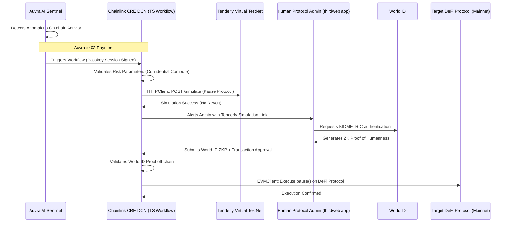

# Auvra AI Architecture

The architecture seamlessly weaves Auvra Agentic Payments, Chainlink CRE, Tenderly, and World ID into a unified risk-firewall.

## Architecture Diagram

### Components Breakdown

1. **AI Risk Sentinel (Auvra Agent)**:
   - Node.js background worker running risk heuristic models.
   - Initialized via `@veridex/agentic-payments` SDK.
   - Possesses a 24-hour time-limited, fund-limited passkey generated by a human founder.

2. **Chainlink CRE (The Orchestrator)**:
   - Built via the `@chainlink/cre-sdk` in TypeScript.
   - Contains a `handler()` that maps an `http.Trigger` to the core logic callback.
   - Interacts with both `HTTPClient` and `EVMClient` concurrently.
   
3. **Tenderly API**:
   - Accepts the proposed `data` payload and simulates exactly what the result will be without spending gas or risking mainnet assets.

4. **World ID Integration**:
   - Embedded using the `IDKit` interface into a lightweight React frontend deployed alongside the protocol.
   - Guarantees the actor signing the final protocol change is a real human (Sybil and AI-resistant). 
